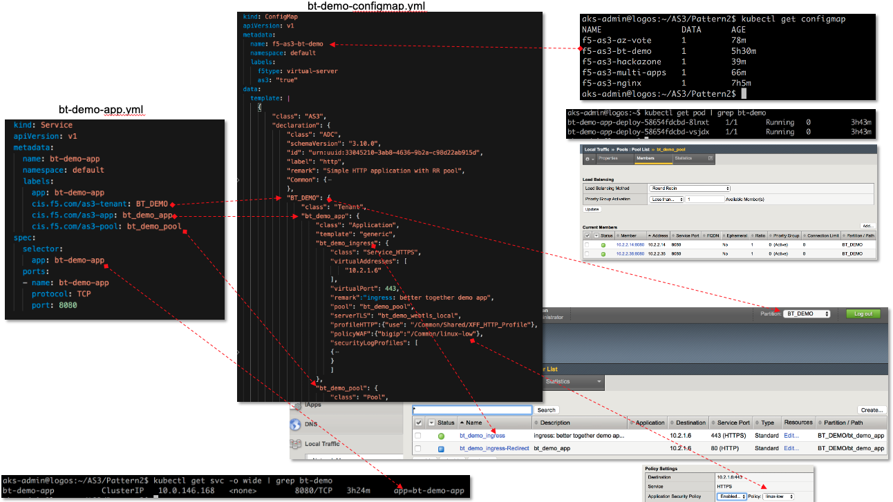

Traffic Groups
===========================

**Description**: 
F5's ScaleN (N+1) architecture allows you to create a redundant system configuration for multiple BIG-IP devices on a network. This is made possible by using traffic groups. 

**Traffic groups**

A traffic group is a collection of related configuration objects, such as a **floating self IP address** , a **virtual IP address** , and a **SNAT translation address** , that run on a BIG-IP device. Together, these objects process a particular type of application traffic on that device. When a BIG-IP device becomes unavailable, a traffic group floats (that is, fails over) to another device in a device group to ensure that application traffic continues to be processed with little to no interruption in service. In general, a traffic group ensures that when a device becomes unavailable, all of the failover objects in the traffic group fail over to any one of the available devices in the device group.

A traffic group is initially active on the device on which you create it, until the traffic group fails over to another device. For example, if you initially create three traffic groups on Device A, these traffic groups remain active on Device A until one or more traffic groups fail over to another device. If you want an active traffic group to become active on a different device in the device group when failover has not occurred, you can intentionally force the traffic group to switch to a standby state, thereby causing failover to another device.

Only objects with floating IP addresses can be members of a floating traffic group.

An example of a set of objects in a traffic group is an iApps application service. If a device with this traffic group is a member of a device group, and the device becomes unavailable, the traffic group floats to another member of the device group, and that member becomes the device that processes the application traffic.

For a full guide to traffic groups, please refer to the official documentation on |askf5|_ or |clouddocs|_. 

.. |askf5| replace:: AskF5
.. _askf5: https://techdocs.f5.com/en-us/bigip-14-1-0/big-ip-device-service-clustering-administration-14-1-0/introducing-big-ip-device-service-clustering.html#GUID-8766A4E7-4D1F-4BF8-AFBE-8037AE89FD08
.. |clouddocs| replace:: F5 Cloud Docs
.. _clouddocs: https://clouddocs.f5.com/training/community/f5cert/html/class6/module10/lab3.html

