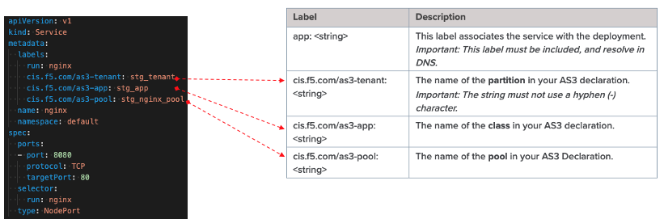

CIS and ScaleN (N+1) - w/ out Auto Config-Sync
===========================

**Description**: 
This design pattern is similar to the previous design except auto config-sync is disabled, therefore multiple CIS instances will be used to configure other devices in the cluster. 

**Sample Diagram**:

|mod-2-1|

Configuration tips and caveats
------------------
- Ensure no more than 3 CIS point to a single VE (max tested)

