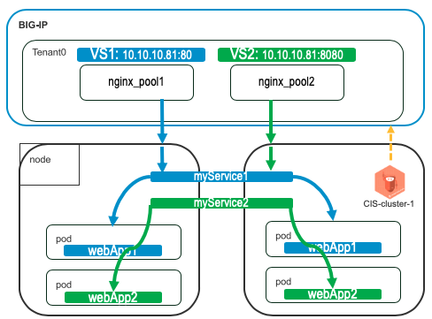
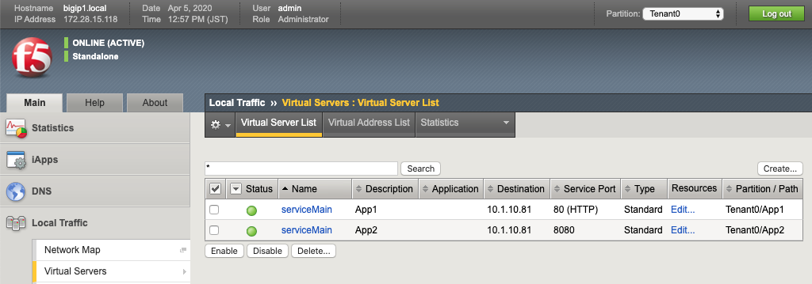
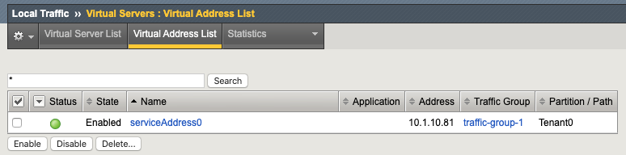
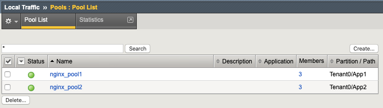
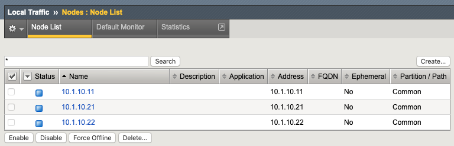

AS3 Configmap: Multiple Apps in Single Partition - Single Virtual Address
================================================

**Description**: 
This section will cover some best practices, tips, and caveats when configuring multiple apps (virtual servers) in the AS3 declaration. In this scenario, an application owner wants to configure multiple applications that may use different protocols. The tenant/partition will be the same.
For more examples, see |github|_. 

**Prerequisites**: 
- Basic understanding REST APIs and declarative configuration.

**Diagrams**:

|mod-4-1|

Summary
------------------
You can declare multiple applications (virtual servers) in a single partition/tenant. 

#. Define one tenant
#. Define one virtual address in a Shared application block
#. Define first application in the tenant block referencing above virtual address using :code:`"use"`
#. Similarly, define second application in the same tenant block

.. code-block:: yaml
   :emphasize-lines: 21-29,30,54

    kind: ConfigMap
    apiVersion: v1
    metadata:
    name: f5-as3-declaration1
    namespace: kube-system
    labels:
        f5type: virtual-server
        as3: "true"
    data:
    template: |
        {
            "class": "AS3",
            "declaration": {
                "class": "ADC",
                "schemaVersion": "3.18.0",
                "id": "testapp",
                "label": "Two HTTP VS with one VIP",
                "remark": "example",
                "Tenant0": {
                    "class": "Tenant",
                    "Shared": {
                        "class": "Application_Shared",
                        "template":"shared",
                        "serviceAddress0": {
                            "class": "Service_Address",
                            "virtualAddress": "10.1.10.81",
                            "trafficGroup": "/Common/traffic-group-1"
                        }
                    },
                    "App1": {
                        "class": "Application",
                        "template": "http",
                        "serviceMain": {
                            "class": "Service_HTTP",
                            "virtualAddresses": [{ "use": "/Tenant0/Shared/serviceAddress0"}],
                            "virtualPort": 80,
                            "pool": "nginx_pool1"
                        },
                        "nginx_pool1": {
                            "class": "Pool",
                            "monitors": [
                                "http"
                            ],
                            "members": [
                                {
                                    "servicePort": 80,
                                    "serverAddresses": [],
                                    "shareNodes": true
                                }
                            ]
                        }
                    },
                    "App2": {
                        "class": "Application",
                        "template": "http",
                        "serviceMain": {
                            "class": "Service_HTTP",
                            "trafficGroup": "traffic-group-1",
                            "virtualAddresses": [{ "use": "/Tenant0/Shared/serviceAddress0"}],
                            "virtualPort": 8080,
                            "pool": "nginx_pool2"
                        },
                        "nginx_pool2": {
                            "class": "Pool",
                            "monitors": [
                                "http"
                            ],
                            "members": [
                                {
                                    "servicePort": 80,
                                    "serverAddresses": [],
                                    "shareNodes": true
                                }
                            ]
                        }
                    }
                }
            }
        }

**Confirm BIG-IP Objects**:

- Two Virtual Servers listening on different ports in the same partition (Tenant0)

    |mod-4-2|

- One Virtual IP in traffic-group-1

    |mod-4-3|

- Two pools associated with each Virtual Server

    |mod-4-4|

- The nodes (pool member IPs) are automatically discovered and placed in the :code:`/Common` partition

    |mod-4-5|

.. |github| replace:: F5 DevCentral f5-k8s-demo repository
.. _github: https://github.com/f5devcentral/f5-k8s-demo/tree/master/chen-k8s-demo/deployment

