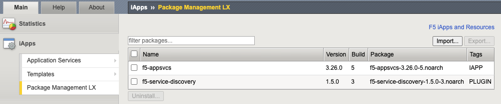
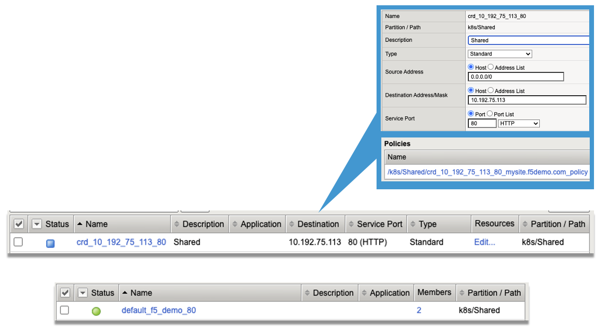

CIS New Installation
================================================

**Description**: 
Below are quick instructions for environment setup and installation of F5 CIS and F5 BIG-IP for load balancing and securing traffic into your Kubernetes cluster.  For a full guide to these topics, please refer to the official documentation on `Clouddocs`_ . 

BIG-IP Configuration
------------------

Confirm below requirements for deploying CIS

#. AS3 is an extension that allows configuration via declarative API. Version 3.18+ must be installed on your BIG-IP system. Download the rpm file from `F5 Networks GitHub`_. Login to BIG-IP GUI > iApps > Package Management LX > Click "Import...".

    |mod-6-1|

#. Create a BIG-IP partition to manage Kubernetes objects. This partition can be created either via the GUI (System > Users > Partition List) or via our TMOS CLI:

    .. code-block:: console
        
        create auth partition <cis_managed_partition>

#. Create a user on BIG-IP with admin access. Login to BIG-IP GUI > System > Users > Click "Create..." > Set password > For Partition Access, select Administrator for Role > Click "Add" > Click "Finished". Note: Ensure that the password does not contain reserved characters. https://support.f5.com/csp/article/K2873

#. For Cluster mode integration using BGP, confirm that you have the "Routing Bundle" that enables use of zebos. 

    .. code-block:: console

        [admin@ip-10-1-1-5:Active:Standalone] ~ # tmsh show sys license | grep -i routing
            Routing Bundle, VE

        [admin@ip-10-1-1-5:Active:Standalone] ~ # zebos check
        === route domain: 0 ===
        nsm is running [23183]
        imi is running [23182]
        bgpd is running [23184]

BIG-IP Optimizations (Optional)
------------------
If you have a large cluster or expect to have many Kubernetes tenants, namespaces and app workloads that need to be exposed on BIG-IP, make below optimizations on BIG-IP to support the increased control plane calls. 

#. Log into BIG-IP as administrator and make below changes:

    .. code-block:: console

        # https://my.f5.com/manage/s/article/K13996055

        tmsh modify sys db provision.extramb value 2048

        tmsh modify sys db restjavad.useextramb value true

        tmsh modify sys db provision.restjavad.extramb value 1600

        tmsh save sys config

        curl -s -f -u admin -H "Content-Type: application/json" -d '{"maxMessageBodySize":134217728}' -X POST http://localhost:8100/mgmt/shared/server/messaging/settings/8100

        # https://my.f5.com/manage/s/article/K52650034
        sysctl -w net.netfilter.nf_conntrack_tcp_timeout_time_wait=30

CIS Installation in Kubernetes
------------------

#. Create secret used for authentication to F5 BIG-IP from CIS.

    .. code-block:: console
        
        kubectl create secret generic bigip-login -n kube-system --from-literal=username=cis_usr --from-literal=password=XXX

#. Create service account

    .. code-block:: console
        
        kubectl create serviceaccount bigip-ctlr -n kube-system

#. Create cluster role binding for the service account

    .. code-block:: console
        
        kubectl create clusterrolebinding k8s-bigip-ctlr-clusteradmin --clusterrole=cluster-admin --serviceaccount=kube-system:bigip-ctlr

#. Create service account

    .. code-block:: console
        
        kubectl create serviceaccount bigip-ctlr -n kube-system

#. (Optional) Create secret containing repository credentials. Modify registry as needed

    .. code-block:: console
        
        kubectl create secret generic f5-docker-images --from-file=.dockerconfigjson=/root/.docker/config.json --type=kubernetes.io/dockerconfigjson -n kube-system

#. Define deployment for CIS. Note: Below manifest will use Cluster mode, watch all namespaces (default), output debug messages (can change to info as needed), work for IPv4 only environment, and pulls the latest image from docker (you can change to your local registry).

    .. code-block:: yaml

        apiVersion: apps/v1
        kind: Deployment
        metadata:
          name: k8s-bigip-ctlr-deployment
          namespace: kube-system
        spec:
          replicas: 1
          selector:
            matchLabels:
              app: k8s-bigip-ctlr
          strategy:
            type: RollingUpdate
          template:
            metadata:
              labels:
                app: k8s-bigip-ctlr
              name: k8s-bigip-ctlr
            spec:
              serviceAccountName: bigip-ctlr
              containers:
                - args:
                    - --bigip-username=$(BIGIP_USERNAME)
                    - --bigip-password=$(BIGIP_PASSWORD)
                    - --bigip-url=<ip_address-or-hostname>
                    - --bigip-partition=k8s
                    - --pool-member-type=cluster
                    - --insecure=true
                    - --agent=as3
                    - --log-level=info
                    - --custom-resource-mode=true
                    - --log-as3-response=true
                    - --as3-validation=true
                  command:
                    - /app/bin/k8s-bigip-ctlr
                  env:
                    - name: BIGIP_USERNAME
                      valueFrom:
                        secretKeyRef:
                          key: username
                          name: bigip-login
                    - name: BIGIP_PASSWORD
                      valueFrom:
                        secretKeyRef:
                          key: password
                          name: bigip-login
                  image: prod.docker.artifactory.rmn.local/f5/bigip/k8s-bigip-ctlr:2.2.1
                  imagePullPolicy: IfNotPresent
                  name: k8s-bigip-ctlr
              dnsPolicy: ClusterFirst
              #imagePullSecrets:
              #  - name: f5-docker-images

#. Apply deployment manifest file for CIS. This will create a pod in kube-system namespace with replica of "1".

    .. code-block:: console
        
        kubectl apply -f f5-cis-deployment.yaml

#. Confirm logs of CIS if any issues

    .. code-block:: console
        
        kubectl logs <k8s-bigip-ctlr-###> -n kube-system

#. Install the F5 CIS CRDs

    .. code-block:: console

        kubectl apply -f https://raw.githubusercontent.com/F5Networks/k8s-bigip-ctlr/master/docs/config_examples/customResourceDefinitions/customresourcedefinitions.yml

Expose Application using F5 CIS 
------------------

#. Create a VirtualServer custom resource (CR). The service parameter is the name of your application service that is of type "ClusterIP"

    .. code-block:: yaml

        apiVersion: "cis.f5.com/v1"
        kind: VirtualServer
        metadata:
          name: f5-demo-mysite
          labels:
            f5cr: "true"
        spec:
          host: mysite.f5demo.com
          virtualServerAddress: "10.192.75.113"
          pools:
          - monitor:
              interval: 20
              recv: ""
              send: /
              timeout: 31
              type: http
            path: /
            service: f5-demo
            servicePort: 80

#. Apply the VirtualServer CR. This will create a pod in kube-system namespace with replica of "1".

    .. code-block:: console
        
        kubectl apply -f vs-mysite-test.yaml

#. Confirm the VirtualServer objects

    .. code-block:: console
        
        kubectl get vs

#. Confirm objects on BIG-IP

    |mod-6-2|

#. Confirm access from client to the exposed IP Address on BIG-IP. 

.. _`Clouddocs`: https://docs.cloud.f5.com/docs/how-to/site-management/create-kvm-libvirt-site

.. _`F5 Networks GitHub`: https://github.com/F5Networks/f5-appsvcs-extension/releases

